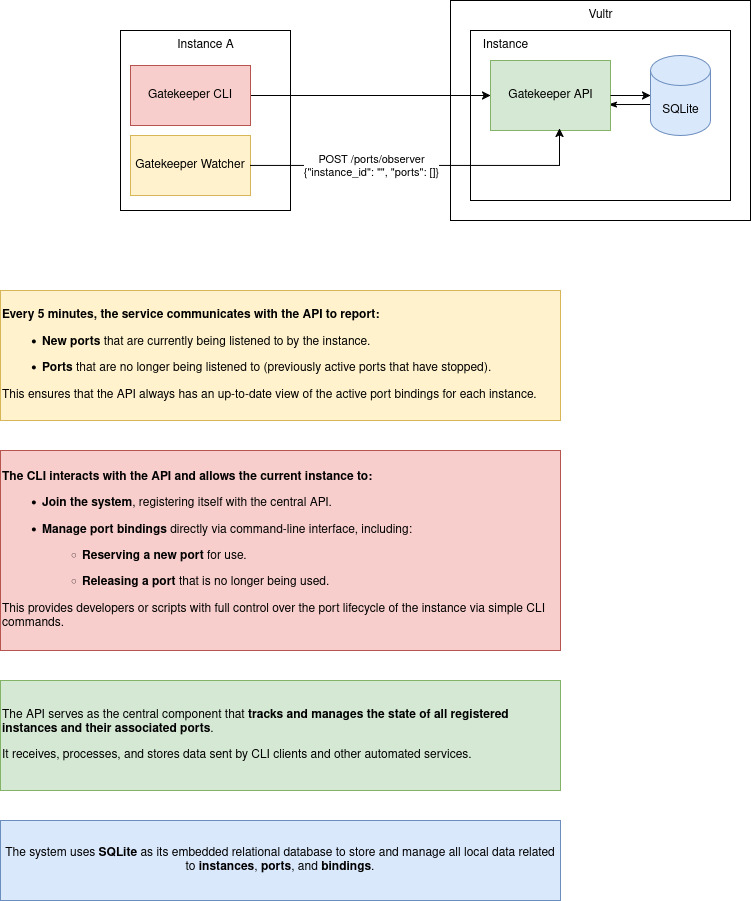

# Gatekeeper

**Gatekeeper** is a system for managing reserved network ports and registered instances in a distributed infrastructure. It consists of the following core components:

* A **REST API** that centralizes data about ports and instances.
* A **CLI** to register instances and manage port allocation.
* A lightweight **SQLite** database for local and efficient data persistence.

---

## Overview

Each machine (instance) can register itself through the CLI and interact with the API to:

* Reserve available ports.
* Release unused ports.
* View the port usage history.
* List all registered instances.

In addition, the system includes an **Agent** that automatically monitors the local environment and keeps the system in sync.




---

## Components

### API

The central service that stores and exposes data about:

* Registered instances
* Reserved ports and their status
* Port usage history

### CLI

A command-line interface (`main`) that allows users to:

* Register a new instance (`join`)
* Reserve or release ports
* View historical and real-time port data
* List known instances

### SQLite Database

A local, file-based relational database used by the API to store:

* Instance metadata (hardware details, hostnames, etc.)
* Port allocations and historical bindings
* Activity timestamps for audits and analysis

---

## Getting Started

### 1. Start the API (Server)

```bash
python3 api/src/main.py
```

The server will be available at `http://localhost:5000`.

### 2. Use the CLI

Example commands:

```bash
# Register the current machine
python cli/src/main.py instance join

# List registered instances
python cli/src/main.py instance list

# Reserve a new available port
python cli/src/main.py port reserve

# Reserve a new range of ports
python cli/src/main.py port reserve --range 80

# Release a port that is no longer in use
python cli/src/main.py port release --port 8080

# Release a range of ports that is no longer in use
python cli/src/main.py port release --range 8000:8080

# View the port usage history
python cli/src/main.py port history
```

To see full CLI options:

```bash
python cli/src/main.py --help
```

---

## 📌 Requirements

* Python 3.10+
* Linux (for port detection using `psutil`)
